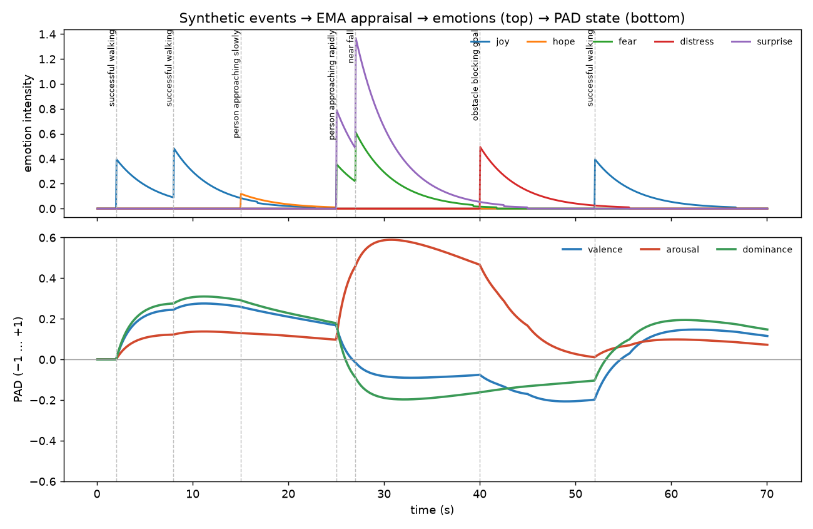

# NERVA affect model v0: synthetic events → appraisal → emotion → PAD

This is a simulation-only prototype. It is **not** connected to the robot's movement yet. Every number in it is either taken from a cited model or marked as a NERVA design choice. None of it is a validated model of human emotion.

## Pipeline

```
Event ──appraise()──▶ AppraisalState ──categorise()──▶ emotion instances ──▶ AffectModel ──▶ PADState
(perception)   nerva/appraisal.py   (EMA rules)      (label, intensity)   (ALMA-style        (persistent,
                                    nerva/affect.py                        dynamics)          evolves in time)
```

## 1. Appraisal: `nerva/appraisal.py` [NERVA design]

Each synthetic event has a fixed appraisal. EMA defines the *variables* (Marsella & Gratch 2009, §2.3.3). The *values* below are our judgement of what each event means for a small walking robot. `Event.magnitude` scales desirability.

| event | relevance | desirability | likelihood | expectedness | controllability | reasoning |
|---|---|---|---|---|---|---|
| successful_walking | 0.5 | +0.4 | 1.0 | 0.9 | 0.9 | goal progress has happened, as expected, under own control |
| near_fall | 1.0 | −0.8 | 0.5 | 0.1 | 0.3 | a fall is possible, not certain; sudden; hard to prevent |
| person_approaching_slowly | 0.4 | +0.2 | 0.6 | 0.7 | 0.7 | possible interaction; mildly positive; anticipated |
| person_approaching_rapidly | 0.9 | −0.6 | 0.6 | 0.2 | 0.3 | possible collision; sudden; little time to react |
| obstacle_blocking_goal | 0.8 | −0.5 | 1.0 | 0.5 | 0.6 | the goal *is* blocked; the robot can try to go around |

"Likelihood" is the likelihood of the appraised outcome (for near_fall, the outcome "I fall"). Following EMA, an outcome in the present is certain (1.0) and a future one is uncertain (< 1).

## 2. Emotion categorisation: `affect.categorise()` [EMA]

These rules are from EMA (Marsella & Gratch 2009, Table 2), with intensities from Gratch & Marsella 2004, Table 3:

| appraisal pattern | emotion | intensity |
|---|---|---|
| desirability > 0, likelihood < 1 | hope | abs(d × l) |
| desirability > 0, likelihood = 1 | joy | abs(d × l) |
| desirability < 0, likelihood < 1 | fear | abs(d × l) |
| desirability < 0, likelihood = 1 | distress (EMA 2009 calls it "sadness") | abs(d × l) |
| expectedness low | surprise | **1 − expectedness** [NERVA: EMA gives no intensity rule] |

- "Low" expectedness means **< 0.3** [NERVA threshold].
- An appraisal with relevance 0 produces no emotion. In EMA, relevance means non-zero utility.
- **Not implemented:** anger and guilt, which need EMA's *causal attribution* (blame). None of our five events involves a blameworthy agent. `AppraisalState` has no attribution field yet, and one should be added when an event needs it.

## 3. Emotion → PAD point [ALMA, plus one WASABI value, plus one NERVA hypothesis]

Each emotion label has a PAD point, from ALMA (Gebhard 2005, Table 2):

| emotion | P | A | D | source |
|---|---|---|---|---|
| joy | 0.40 | 0.20 | 0.10 | ALMA Table 2 |
| hope | 0.20 | 0.20 | −0.10 | ALMA Table 2 |
| fear | −0.64 | 0.60 | −0.43 | ALMA Table 2 |
| distress | −0.40 | −0.20 | −0.50 | ALMA Table 2 |
| surprise | 0.10 | 0.80 | 0.00 | WASABI Table 1 "surprised" (10, 80, ±100), rescaled to ±1. WASABI allows either sign of D; **0 is our choice** |

**Controllability → dominance [NERVA hypothesis]:**
- Each emotion instance's dominance is blended with the appraised controllability: `D = (1 − w)·D_emotion + w·(2·controllability − 1)`, with `w = 0.5`.
- Precedent: WASABI derives dominance from the situational context in cognition rather than from the emotion itself (Becker-Asano & Wachsmuth 2010, §3.3). Appraisal theories treat coping potential or control as a determinant of the emotional response (Marsella & Gratch 2009, §2.1).
- The specific blend and weight are ours.

## 4. Dynamics: `affect.AffectModel` [ALMA/WASABI structure, NERVA parameters]

**Active emotions** decay exponentially: `intensity(t) = intensity₀ · exp(−t / τ_emotion)`. They are dropped below 0.01. ALMA decays emotions too, linearly over about 1 minute in its example.

**Emotion centre** `E` is the intensity-weighted mean PAD point of the active emotions. Its strength `I` is the **mean** intensity of the active emotions, as in ALMA's "virtual emotion center" (Gebhard 2005, §3).

**PAD state** `x` (NERVA's persistent affect, ALMA's "mood") follows

```
dx/dt = k_pull · I · (E − x)  +  (x_base − x) / τ_return
```

- The first term is ALMA's *pull* phase: active emotions attract the state.
- The second is the return to the default state (ALMA's "mood return"; WASABI's drive back to balance).
- ALMA's *push* phase is **not implemented**. That is where the mood is pushed further once it passes the emotion centre.
- Between updates `I` and `E` are held constant, so the linear equation is integrated **exactly** (`x ← x* + (x − x*)·exp(−(a+b)·dt)`). The result therefore does not depend on the update rate.
- `x` is clipped to [−1, 1].

**Parameters [NERVA choices, for a robot reacting on a scale of seconds]:**

| parameter | value | ALMA's value, for comparison (conversational agents) |
|---|---|---|
| τ_emotion | 4 s | about 60 s linear decay |
| k_pull | 1.0 /s at full intensity | "usual mood change time" 10 min |
| τ_return | 20 s | return over 20 min for the largest distance |
| baseline x_base | (0, 0, 0) | derived from Big-Five personality |

All parameters live in `AffectConfig` and can be replaced without touching the code.

## Demo: `experiments/affect_prototype/run.py`

A scripted 70 s timeline of the five events. Output is in `experiments/affect_prototype/results/` (`timeline.csv`, `pad_timeline.png`).



**Behaviour checked [measured on the demo]:**
- Events nudge the PAD state; they don't switch it. The emotions decay over a few seconds, and PAD relaxes toward baseline.
- Across person_approaching_rapidly (t = 25 → 27 s):
  - valence 0.17 → −0.01
  - arousal 0.10 → 0.46
  - dominance 0.18 → −0.08
- That direction follows from the tables by construction.

**Design weaknesses the demo exposes [open decisions, not bugs]:**
1. **Surprise dilutes negative valence.** After near_fall, valence only reaches about −0.09. Surprise (intensity 0.9, P = +0.1 from WASABI) outweighs fear (0.4, P = −0.64) in the intensity-weighted centre. Many accounts treat surprise as valence-neutral. An option is P = 0 for surprise, or excluding surprise from the valence average.
2. **Relevance does not scale intensity** (EMA uses it only as a gate). So routine successful_walking (relevance 0.5) moves valence to +0.27 and dominance to +0.31 after two occurrences. An option is intensity × relevance, which would be a NERVA extension of EMA.
3. **Arousal persists** about 13 s after near_fall (still 0.47), set by τ_return = 20 s. What persistence is appropriate for a robot is an open question.
4. **Weak emotions** (hope 0.12) have almost no visible effect. That may be acceptable.

## What this model is and isn't

- **It is** an explicit, inspectable engineering model. Every step can be traced back to a table in this document, and every step can be replaced independently. For example:
  - a learned appraisal instead of the event table
  - a different emotion → PAD table
  - direct appraisal → PAD without labels
- **It isn't** evidence about emotion. If near_fall produces "valence ↓, arousal ↑, dominance ↓", that follows *by construction* from the tables above. The model makes no prediction that could have failed. Validation would need:
  - human judgements of whether the resulting *behaviour* reads as intended (RQ4)
  - a comparison with alternative mappings

## Sources

- S. C. Marsella, J. Gratch. *EMA: A process model of appraisal dynamics.* Cognitive Systems Research 10(1), 70–90, 2009.
- J. Gratch, S. Marsella. *A domain-independent framework for modeling emotion.* Cognitive Systems Research 5(4), 269–306, 2004.
- P. Gebhard. *ALMA – A Layered Model of Affect.* AAMAS 2005.
- C. Becker-Asano, I. Wachsmuth. *Affective computing with primary and secondary emotions in a virtual human.* Autonomous Agents and Multi-Agent Systems 20, 32–49, 2010.
- A. Mehrabian. PAD temperament model; cited by ALMA as the basis of its mood space.
