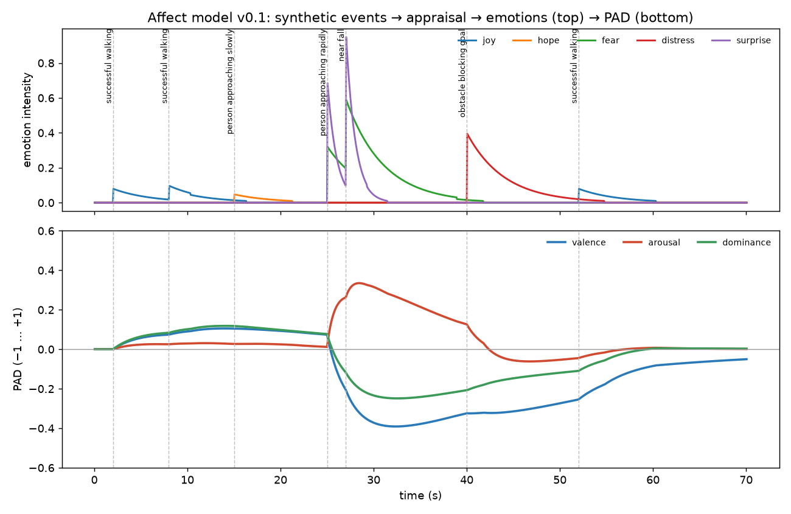

# NERVA affect model v0.1 ("Model A"): synthetic events → appraisal → emotions → PAD

This is a simulation-only prototype. It is **not** connected to the robot's movement. Every number is either taken from a cited model or marked as a NERVA design choice. It is an engineered internal state for studying expressive behaviour, not a model of real emotion. If the demo shows "valence down, arousal up, dominance down", what that means is that *PAD moved that way under our chosen mapping*. It does not mean the robot is afraid.

## Where this sits in the architecture

The canonical NERVA chain is appraisal → persistent affect (PAD) → behaviour (`architecture.md`). Any affect model must satisfy `nerva.interfaces.AffectSystem`: `AppraisalState` in, `PADState` out.

This model, `CategoricalAffectModel` in `nerva/affect/emotions.py`, is **Model A**. It passes through discrete emotion labels:

```
Event ─appraise()─▶ AppraisalState ─categorise()─▶ emotion instances ─▶ PAD anchors ─▶ persistent PAD
      nerva/affect/appraisal.py            (label, intensity)                  (ALMA)        (ALMA-style dynamics)
```

The labels (joy, fear, …) are meant to be an implementation detail of Model A, **not a required NERVA layer**. A planned **Model B** maps appraisal to PAD directly.

> **Audit 2026-10-02:** this was not true in the code. Behaviour now reads `ActionTendencyState`, produced by Model A through `nerva/affect/tendencies.py` (stage C). Entity memory, place memory and episodic replay still consume the labels until stage D (`architecture.md` §1.2–1.3).

## 1. Appraisal v0 table: `nerva/affect/appraisal.py` [NERVA design values]

(The reactive loop uses the contextual appraiser v1 and the memory-based v2 in the same file; the v0 table remains as a fallback and for the scripted demos.)

The *variables* come from EMA (Marsella & Gratch 2009, §2.3.3). The *values* are our judgement for a small walking robot. `Event.magnitude` scales desirability.

**This is a context-free lookup table and not the target design.** Real appraisal must depend on context: goals, physical state, expectations, history and available actions. For example, "person approaching rapidly" should be expected and controllable if NERVA invited the person, and undesirable and uncontrollable if NERVA is unstable near a wall.

| event | relevance | desirability | likelihood | expectedness | controllability | reasoning |
|---|---|---|---|---|---|---|
| successful_walking | **0.2** (v0: 0.5) | +0.4 | 1.0 | 0.9 | 0.9 | *routine* progress: expected, low-stakes, under own control |
| near_fall | 1.0 | −0.8 | 0.5 | 0.1 | 0.3 | a fall is possible, not certain; sudden; hard to prevent |
| person_approaching_slowly | 0.4 | +0.2 | 0.6 | 0.7 | 0.7 | possible interaction; mildly positive; anticipated |
| person_approaching_rapidly | 0.9 | −0.6 | 0.6 | 0.2 | 0.3 | possible collision; sudden; little time to react |
| obstacle_blocking_goal | 0.8 | −0.5 | 1.0 | 0.5 | 0.6 | the goal *is* blocked; the robot can try to go around |

Likelihood is the likelihood of the appraised outcome (for near_fall, "I fall"). As in EMA, a present outcome is certain (1.0) and a future one is uncertain (< 1).

## 2. Emotion categorisation: `categorise()` [simplified EMA-inspired + NERVA extensions]

| appraisal pattern | emotion | intensity |
|---|---|---|
| desirability > 0, likelihood < 1 | hope | relevance × abs(d × l) |
| desirability > 0, likelihood = 1 | joy | relevance × abs(d × l) |
| desirability < 0, likelihood < 1 | fear | relevance × abs(d × l) |
| desirability < 0, likelihood = 1 | distress (EMA 2009: "sadness") | relevance × abs(d × l) |
| expectedness < 0.3 | surprise | relevance × (1 − expectedness) |

**What is sourced:**
- The label rules come from Marsella & Gratch 2009, Table 2.
- The base intensity abs(desirability × likelihood) is the intensity rule listed for hope, joy, fear and distress in Gratch & Marsella 2004, Table 3.

**What is simplified or ours:**
- **This is not EMA's full intensity model.** EMA computes intensity per *appraisal frame* (one per proposition in its causal interpretation). It adds the current mood to each frame's intensity ("mood-adjusted" intensity), and a focus mechanism selects the frame that drives expression and coping. We implement none of that: no causal interpretation, no frames, no mood adjustment, no focus, no coping.
- **Relevance scaling** (`scale_by_relevance`, v0.1) is a NERVA extension. In EMA, relevance only determines whether a proposition is appraised at all.
- The surprise intensity rule and the 0.3 threshold are ours; EMA only says expectedness is "low".
- Anger and guilt are not implemented: they need causal attribution, which `AppraisalState` does not have yet.

## 3. Emotion → PAD anchor [ALMA; surprise and the dominance blend are NERVA]

| emotion | V (P) | A | D | source |
|---|---|---|---|---|
| joy | 0.40 | 0.20 | 0.10 | ALMA (Gebhard 2005) Table 2 |
| hope | 0.20 | 0.20 | −0.10 | ALMA Table 2 |
| fear | −0.64 | 0.60 | −0.43 | ALMA Table 2 |
| distress | −0.40 | −0.20 | −0.50 | ALMA Table 2 |
| surprise | — | 0.80 | — | arousal from WASABI Table 1 "surprised" (80/100). **V and D deliberately not affected (NERVA v0.1)** |

- **Surprise [NERVA choice].** Surprise is treated as a short-lived activation/attention effect. It takes part only in the arousal average, and it decays with τ = 1 s instead of 4 s. In v0, surprise had P = +0.1 and took part in all three averages. Because it is usually strong, it cancelled most of fear's negative valence (see *History*).
- **Controllability → dominance [NERVA hypothesis].** For emotions that have a dominance anchor: `D = (1 − w)·D_emotion + w·(2·controllability − 1)`, with `w = 0.5`. The precedent is that WASABI derives dominance from appraised situational context (Becker-Asano & Wachsmuth 2010, §3.3).

## 4. Dynamics: `CategoricalAffectModel` [ALMA/WASABI structure; NERVA parameters]

**Emotions.** Each emotion instance decays exponentially with its own τ and is dropped below intensity 0.01.

**Emotion centre, computed per PAD dimension** (v0.1). For each dimension, over the active emotions that act on it:
- `E_k` is the intensity-weighted mean anchor
- `I_k` is the mean intensity

This follows ALMA's "virtual emotion center", which ALMA computes over all emotions at once.

**PAD state, per dimension k:**

```
dx_k/dt = k_pull · I_k · (E_k − x_k)  +  (baseline_k − x_k) / τ_return,k
```

- The first term is ALMA's *pull* phase. The second is the return to baseline (ALMA's mood return; WASABI's drive back to balance).
- ALMA's *push* phase is not implemented.
- The equation is integrated exactly per step, so results don't depend on dt, and the state is clipped to [−1, 1].

**Parameters (`AffectConfig`). All are engineering choices for a robot reacting within seconds, not psychological constants:**

| parameter | v0.1 | v0 | ALMA (conversational agents), for comparison |
|---|---|---|---|
| τ_emotion | 4 s; surprise **1 s** | 4 s for all | about 60 s linear decay |
| k_pull | 1.0 /s at intensity 1 | same | "usual mood change time" 10 min |
| τ_return (V, A, D) | **20 s, 6 s, 20 s** | 20 s for all | about 20 min |
| relevance scaling | **on** | off | n/a |
| baseline | (0, 0, 0) | same | from Big-Five personality |

## Demo: `experiments/affect_prototype/run.py`

A scripted 70 s timeline of the five events. The outputs of the current version are in `results/v0.1/`; v0 outputs were removed from the repository (regenerate with the v0 configuration).



**Measured on the demo (v0.1 vs v0):**

| | v0 | v0.1 |
|---|---|---|
| valence minimum after near_fall | −0.09 | **−0.39** |
| arousal 11 s after near_fall (t = 38 s) | 0.50 | **0.16** |
| valence after two routine walks (t = 10 s) | +0.27 | **+0.09** |

- **Repeated routine success**, one every 3 s for 60 s: steady valence **+0.16**, where v0's relevance of 0.5 gave +0.22. This is covered by a test with a design target of < 0.2.
- **Weak emotions were left unchanged, as decided.** Relevance scaling makes them weaker still (hope 0.12 → 0.05); nothing amplifies them.

## Known limitations of v0.1 [open, measured]

1. **Intensity controls the *rate* of the pull, not its *extent*.** The state is attracted toward the emotion's anchor point however weak the emotion is. So:
   - frequent weak events drive a lasting level, as in repeated routine success at +0.16
   - one weak joy (0.08) at t = 52 s visibly lifts a negative valence
   Two possible fixes:
   - **Habituation in appraisal:** repeated routine events become less relevant. This is the principled fix, and it belongs to history-aware appraisal (roadmap stage 5).
   - **Dynamics where intensity scales the displacement,** not just the speed. This departs from ALMA and would further weaken small events.
   Neither is implemented; both need a decision.
2. The appraisal is context-free (see §1).
3. There is one baseline and no personality. That is intentional: roadmap stage 20, only after affect-conditioned motion works.

## History

**v0** (commit `47ef051`). Same pipeline, with these differences:
- surprise P = +0.1 and D = 0, taking part in all averages
- no relevance scaling
- one τ_return = 20 s
- routine walking relevance 0.5

The v0 demo exposed four issues: surprise diluting fear, routine events too influential, arousal lasting too long, and weak emotions barely visible. The user decided to fix the first three and leave the fourth. 

## Sources

- S. C. Marsella, J. Gratch. *EMA: A process model of appraisal dynamics.* Cognitive Systems Research 10(1), 70–90, 2009.
- J. Gratch, S. Marsella. *A domain-independent framework for modeling emotion.* Cognitive Systems Research 5(4), 269–306, 2004.
- P. Gebhard. *ALMA – A Layered Model of Affect.* AAMAS 2005.
- C. Becker-Asano, I. Wachsmuth. *Affective computing with primary and secondary emotions in a virtual human.* Autonomous Agents and Multi-Agent Systems 20, 32–49, 2010.
- A. Mehrabian. PAD temperament model; cited by ALMA as the basis of its mood space.
